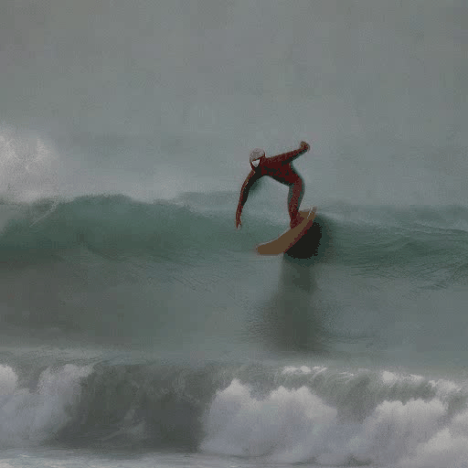
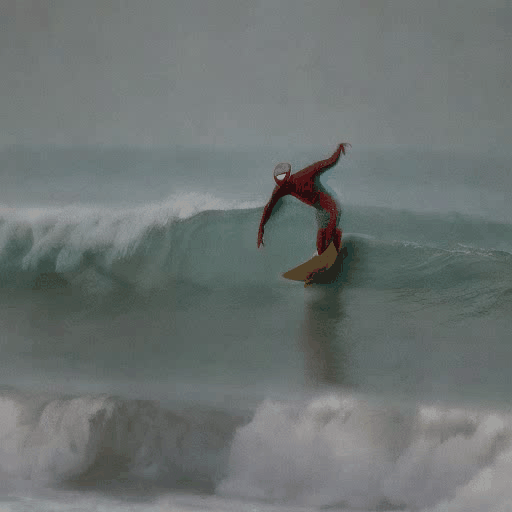
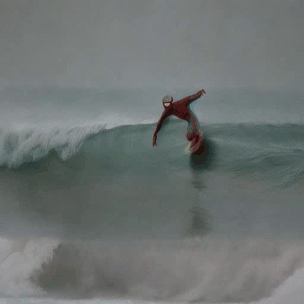
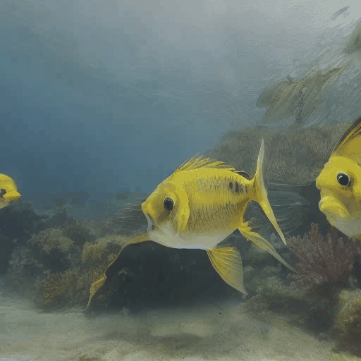
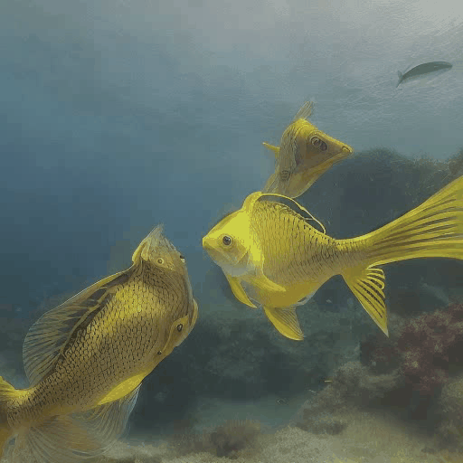
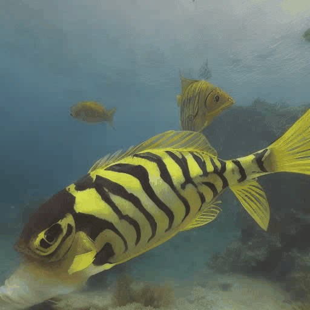

### Noise Optimization

**Recall = 0 refers to the original noise**

**Recall = 1 refers to Li zhen's V2**

**Recall = 2 refers to x_t -> x_{t-1} -> x_t -> x_{t-1} -> x_t -> ... -> x_0**

<table style="width: 100%; border-collapse: collapse; font-family: Arial, sans-serif; font-size: 14px; text-align: center;">
        <thead style="background-color: #f2f2f2; border-bottom: 2px solid #ddd;">
            <tr>
                <th style="padding: 10px;">Recall = 0</th>
                <th style="padding: 10px;">Recall = 1</th>
                <th style="padding: 10px;">Recall = 2</th>
            </tr>
        </thead>
        <tbody>
            <tr>
                <td></td>
                <td></td>
                <td></td>
            </tr>
            <tr style="border-bottom: 1px solid #ddd;">
                <td style="padding: 2px 10px;">"Spiderman is surfing"</td>
                <td style="padding: 2px 10px;">"Spiderman is surfing"</td>
                <td style="padding: 2px 10px;">"Spiderman is surfing"</td>
            </tr>
            <tr>
                <td></td>
                <td></td>
                <td></td>
            </tr>
            <tr style="border-bottom: 1px solid #ddd;">
                <td style="padding: 2px 10px;">"Yellow and black tropical fish dart through the sea"</td>
                <td style="padding: 2px 10px;">"Yellow and black tropical fish dart through the sea"</td>
                <td style="padding: 2px 10px;">"Yellow and black tropical fish dart through the sea"</td>
            </tr>
            <tr>
                <td></td>
                <td></td>
                <td></td>
            </tr>
            <tr style="border-bottom: 1px solid #ddd;">
                <td style="padding: 2px 10px;">"An epic tornado attacking above aglowing city at night"</td>
                <td style="padding: 2px 10px;">"An epic tornado attacking above aglowing city at night"</td>
                <td style="padding: 2px 10px;">"An epic tornado attacking above aglowing city at night"</td>
            </tr>
            <tr>
                <td></td>
                <td></td>
                <td></td>
            </tr>
            <tr style="border-bottom: 1px solid #ddd;">
                <td style="padding: 2px 10px;">"Slow pan upward of blazing oak fire in an indoor fireplace"</td>
                <td style="padding: 2px 10px;">"Slow pan upward of blazing oak fire in an indoor fireplace"</td>
                <td style="padding: 2px 10px;">"Slow pan upward of blazing oak fire in an indoor fireplace"</td>
            </tr>
            <tr>
                <td></td>
                <td></td>
                <td></td>
            </tr>
            <tr style="border-bottom: 1px solid #ddd;">
                <td style="padding: 2px 10px;">"a cat wearing sunglasses and working as a lifeguard at pool"</td>
                <td style="padding: 2px 10px;">"a cat wearing sunglasses and working as a lifeguard at pool"</td>
                <td style="padding: 2px 10px;">"a cat wearing sunglasses and working as a lifeguard at pool"</td>
            </tr>
            <tr>
                <td></td>
                <td></td>
                <td></td>
            </tr>
            <tr style="border-bottom: 1px solid #ddd;">
                <td style="padding: 2px 10px;">"Sunset over the sea"</td>
                <td style="padding: 2px 10px;">"Sunset over the sea"</td>
                <td style="padding: 2px 10px;">"Sunset over the sea"</td>
            </tr>
            <tr>
                <td></td>
                <td></td>
                <td></td>
            </tr>
            <tr style="border-bottom: 1px solid #ddd;">
                <td style="padding: 2px 10px;">"A dog in astronaut suit and sunglasses floating in space"</td>
                <td style="padding: 2px 10px;">"A dog in astronaut suit and sunglasses floating in space"</td>
                <td style="padding: 2px 10px;">"A dog in astronaut suit and sunglasses floating in space"</td>
            </tr>
   </tbody>
</table>    